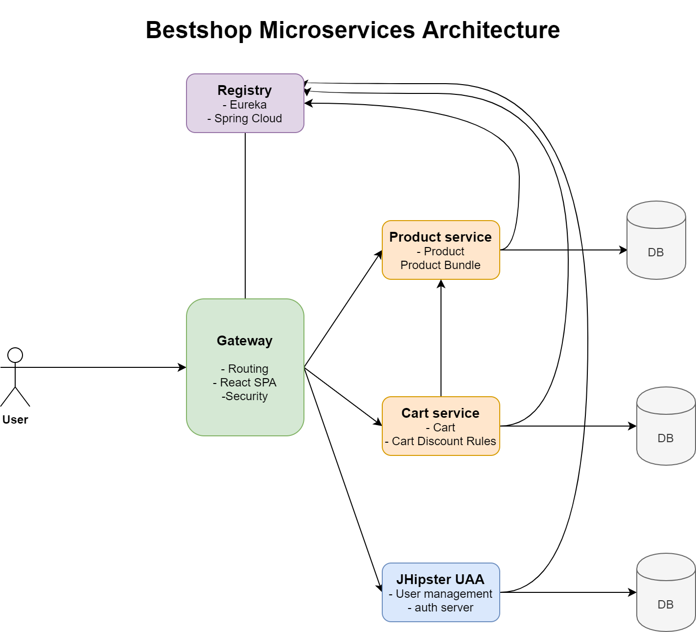
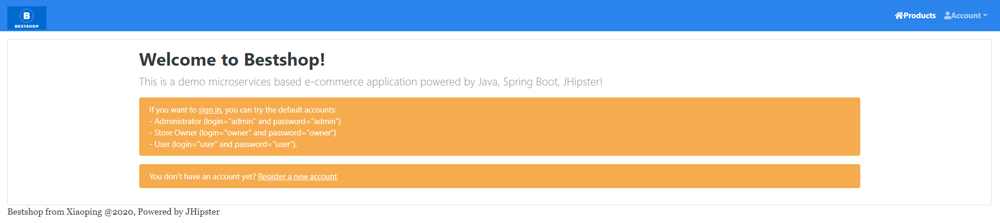
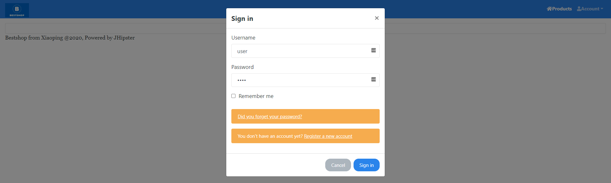
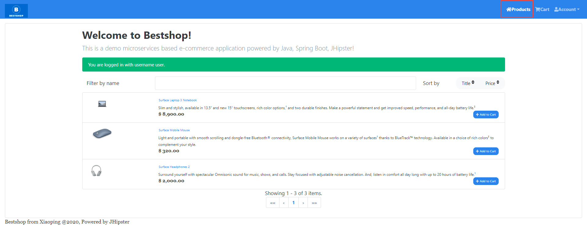
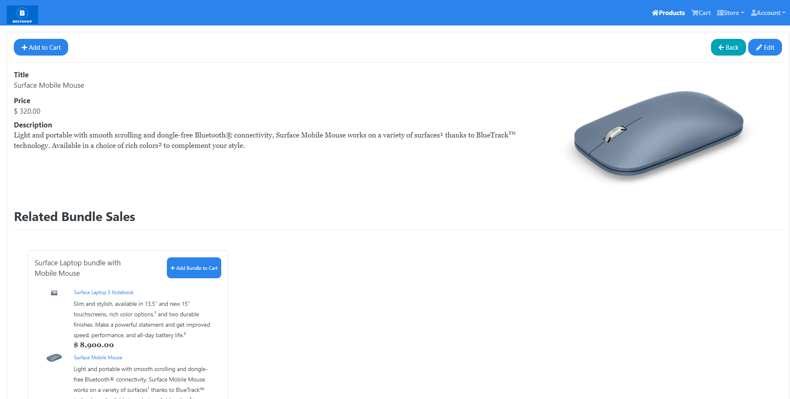
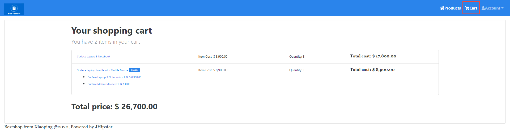
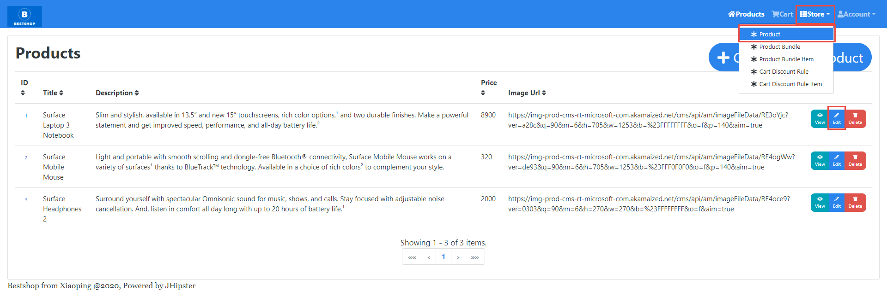
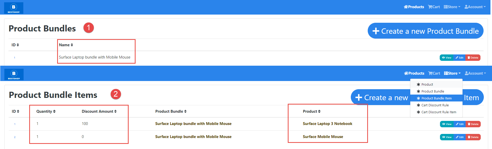
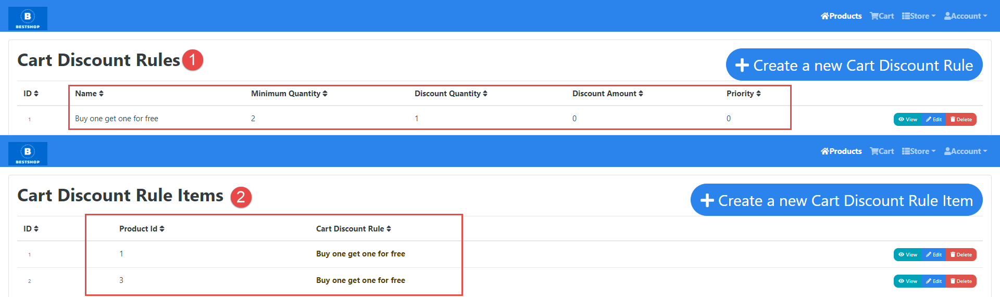

# Bestshop
Demo microservices based e-commerce app with product management and shop cart, Built with Java, Spring boot, React. Powered by jHipster

# Demo on Heroku
https://bestshop-gateway.herokuapp.com/

Users: 
- admin/admin ROLE_ADMIN
- owner/owner ROLE_STORE_OWNER
- user/user ROLE_USER

# Requirments 
## Store owner:
- Create a new product
- Amend the price/description of a product
- Remove a product
- Apply discount deals for products (eg buy 1 get 50% off the second)
- Apply bundle deals (eg buy 1 laptop, get a mouse for free)

## Checkout:
- Add product to basket
- Amend quantity of product in a basket
- Remove product from basket
- Calculate total price and products taking into account all discounts and bundles

# Architecture Diagram

# How to run this application?
- Check out the repository
```
git clone git@github.com:xiaoping-hu/bestshop.git
````
- Run command below in folders: uaa, gateway, product, cart
```
cd uaa
./gradlew bootJar -Pprod jibDockerBuild
cd ../gateway
./gradlew bootJar -Pprod jibDockerBuild
cd ../product
./gradlew bootJar -Pprod jibDockerBuild
cd ../cart
./gradlew bootJar -Pprod jibDockerBuild
cd ..
```
- Boot the application with docker compose
```
docker-compose up -d 
```
- Access the portal from http://localhost:8080
# Screenshots
## Normal User
### Home


### Login


### Product List

### Product Detail

### Cart


## Store Owner

### Prouct Management


### Product Bundle Management


### Cart Discount Rule Management



# Services
## JHipster UAA

## Gateway

## Product

Product service used  providing product list and view for customer, also enable store owners to create and modify products and product bundles.  

### Entities
#### Product
####  Fields


| Field |Java Type|  DB Type | length | required|
| -------- | -------- | -------- | -------- |--------|
| **title**     |String| VARCHAR     | 256     | true|
| **description**    |String | Text     |      | false|
| **price**     |BigDecimal | DECIMAL      |      | true|
| **imageUrl**     |String | VARCHAR      |  2000    | true|

## Product Bundle
#### Fields

| Field |Java Type|  DB Type | length | required|
| -------- | -------- | -------- | -------- |--------|
| **name**     |String| VARCHAR     | 256     | true|
| **bundleItems**     | List |       |      | |

### Product Bundle Item
#### Fields
| Field |Java Type|  DB Type | length | required|
| -------- | -------- | -------- | -------- |--------|

| **quantity**     | Integer |  integer    |    | true|
| **discountAmount**     | Integer |  integer    |      | true|
| **product_id**     |  |  FK   |      | true|
| **product_bundle_id**     |  |  FK    |      | true|

#### Bundle Example
*Buy 1 laptop, get a mouse for free*

| Product | Quantity | discount |
| -------- | -------- | -------- |
| laptop    | 1    | 100     |
| mouse    | 1    | 0     |

## Cart
### Cart Discount Rule
#### Fields
| Field |Java Type|  DB Type | length | required|
| -------- | -------- | -------- | -------- |--------|
| **name**     | String |  VARCHAR    | 256   | true|
| **minimumQuantity**     | Integer |  integer    |      | true|
| **discountQuantity**     | Integer |  integer    |      | true|
| **discountAmount**     | Integer |  integer    |      | true|
| **priority**     | Integer |  integer    |      | true|

### Cart Discount Rule Item
#### Fields
| Field |Java Type|  DB Type | length | required|
| -------- | -------- | -------- | -------- |--------|
| **productId**     | Integer |  integer    |      | true|
| **cart_discount_ruleId**     |  |  FK    |      | true|


#### Discount rule example
*Buy 1 get 50% off the second*

| name | minimumQuantity | discountQuantity | discount |
| -------- | -------- | -------- | -------- |
|  Buy 1 get 50% off the second | 2  | 1 | 50 | 
